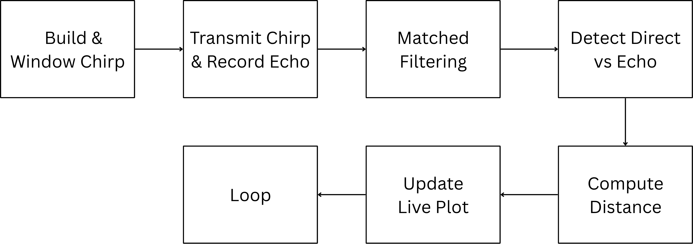

# Real-Time Acoustic Sonar

A real-time sonar built from a laptop speaker and microphone. It transmits ultrasonic-leaning chirp pulses, matched-filters the echo, and plots the measured distance live — no hardware beyond a sound card.



## How it works

1. **Chirp generation** — a linear FM chirp (1–15 kHz) is generated as an analytic signal and Hann-windowed to control spectral leakage.
2. **Transmit/receive** — the pulse train is played through the speaker while the microphone records, using `pyaudio` with producer/consumer threads and queues for glitch-free streaming.
3. **Matched filtering** — the received signal is cross-correlated with the conjugate time-reversed chirp (`fftconvolve`), concentrating echo energy into sharp peaks.
4. **Envelope & peak detection** — the Hilbert-transform envelope is searched for the direct-path peak and first echo (`find_peaks`); their sample offset gives round-trip delay.
5. **Range estimation** — delay is converted to distance using the temperature-corrected speed of sound (`T_air`, default 18 °C), with readings over 20 cm rejected as outliers and a 3-point moving average over what survives, plotted live.

Defaults: 1,500-sample pulse, 1–15 kHz sweep, 44.1 kHz sampling, 12,000-sample receive segment.

## Repo contents

| File | Description |
|---|---|
| `src/realtime_sonar.py` | Real-time distance measurement with live matplotlib plot |
| `src/sonar_dashboard.py` | Same pipeline rendered as a live Bokeh dashboard (`bokeh serve`) |

## Run it

```bash
pip install -r requirements.txt
python src/realtime_sonar.py            # live matplotlib plot
bokeh serve --show src/sonar_dashboard.py   # browser dashboard
```

Point the speaker/mic at a hard surface within ~20 cm and watch the trace. Adjust `Npulse`, `f0`, `f1`, and `T_air` (air temperature, °C) at the bottom of the script.

## Why the useful range stops at 20 cm

The direct path from speaker to microphone arrives first and is far louder than any echo, and on a laptop the two are centimetres apart. Its matched-filter peak has a finite width, so an echo arriving too soon lands inside it and cannot be separated. That sets the near limit. The far limit is the opposite problem: a 1–15 kHz chirp played through a laptop speaker has little energy left by the time a wall returns it. Everything past 20 cm is rejected as an outlier rather than trusted, which is why the readings look sparse when nothing is close.

Sound speed is corrected for air temperature because it moves about 0.6 m/s per °C — assuming 20 °C on a 10 °C day costs roughly 2% of the measured range.

## Limitations

- Accuracy has never been measured against a tape. The output is a live plot, not a calibrated instrument, and there is no ground-truth comparison anywhere in this repo.
- Range resolution is bounded by the chirp bandwidth and the sound-card sample rate. It is not a design parameter here, just what a laptop happens to give.
- Assumes a single specular reflector. In a normal room, multipath returns produce peaks the detector will happily report as a distance.

## Context

Digital Signal Processing project (ELEC3305, University of Sydney, 2025). All code my own.
